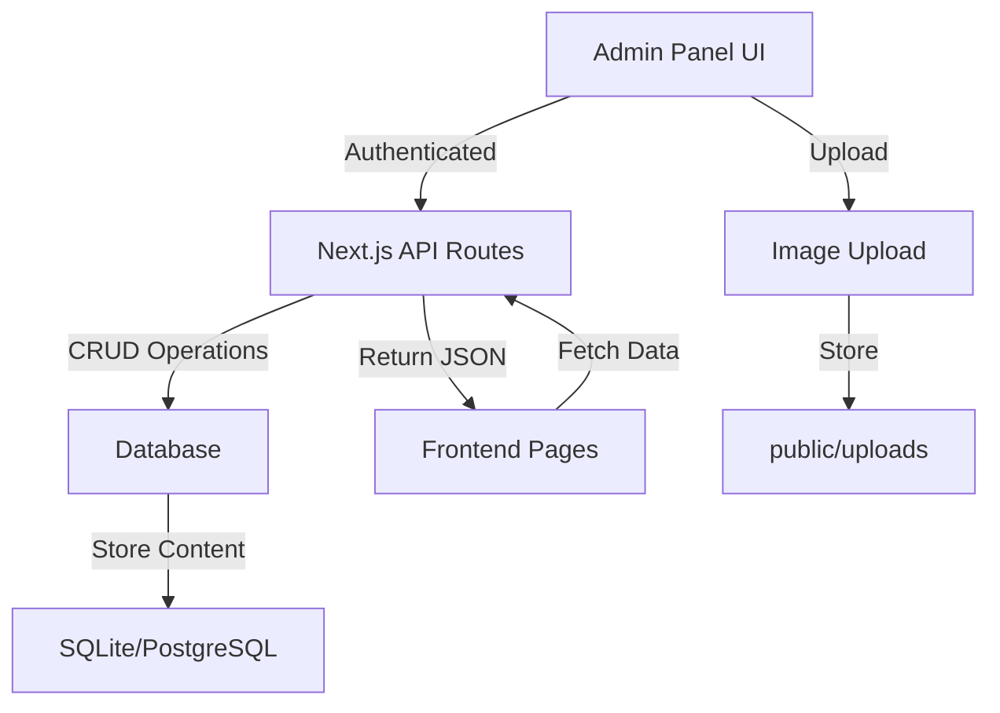

# CM

S Conversion Plan

## Overview

Convert the Next.js application from static markdown-based content to a dynamic CMS with a custom admin panel. The system will allow editing existing pages and adding new content (like News/Blog posts) through a secure backend interface.

## Architecture




## Implementation Steps

### 1. Database Setup

- **File**: `src/lib/db.ts` (new)
- Install `better-sqlite3` or `pg` for PostgreSQL
- Create database schema for:
- `pages` table (Home, About, Contact, Programs, Teams)
- `blog_posts` table (for News/Blog)
- `users` table (for authentication)
- `media` table (for image metadata)

### 2. Authentication System

- **Files**: 
- `src/app/api/auth/login/route.ts` (new)
- `src/app/api/auth/logout/route.ts` (new)
- `src/middleware.ts` (new/update)
- Implement session-based authentication using Next.js cookies
- Create login page at `/admin/login`
- Protect admin routes with middleware

### 3. Admin Panel UI

- **Files**:
- `src/app/admin/page.tsx` (new) - Dashboard
- `src/app/admin/pages/[slug]/edit/page.tsx` (new) - Edit pages
- `src/app/admin/blog/new/page.tsx` (new) - Create new blog post
- `src/app/admin/blog/[id]/edit/page.tsx` (new) - Edit blog post
- `src/app/admin/components/` (new) - Reusable admin components
- Rich text editor (using `react-quill` or similar)
- Image upload component
- Form validation

### 4. API Routes for Content Management

- **Files**:
- `src/app/api/pages/route.ts` (new) - GET all pages, POST new page
- `src/app/api/pages/[slug]/route.ts` (new) - GET, PUT, DELETE specific page
- `src/app/api/blog/route.ts` (new) - GET all posts, POST new post
- `src/app/api/blog/[id]/route.ts` (new) - GET, PUT, DELETE specific post
- `src/app/api/upload/route.ts` (new) - Image upload endpoint

### 5. Update Content Parser

- **File**: `src/lib/contentParser.ts` (modify)
- Add database fetching functions alongside existing markdown parser
- Create `getPageFromDB()` and `getBlogPostFromDB()` functions
- Maintain backward compatibility during migration

### 6. Update Frontend Pages

- **Files to modify**:
- `src/app/page.tsx` - Fetch homepage from database
- `src/app/about/page.tsx` - Fetch from database
- `src/app/contact/page.tsx` - Fetch from database
- `src/app/programs/page.tsx` - Fetch from database
- `src/app/blog/page.tsx` - Fetch blog posts from database
- `src/app/blog/[single]/page.tsx` - Fetch single post from database
- Replace `getListPage()` and `getSinglePage()` calls with database queries
- Keep markdown rendering for content body

### 7. Image Upload System

- **File**: `src/app/api/upload/route.ts` (new)
- Handle multipart/form-data
- Save images to `public/uploads/` directory
- Return image URL for use in content
- Validate file types and sizes

### 8. Migration Script

- **File**: `scripts/migrate-content.ts` (new)
- Read existing markdown files from `src/content/`
- Parse frontmatter and content
- Insert into database tables
- Preserve existing content structure

## Database Schema

```sql
-- Pages table
CREATE TABLE pages (
  id INTEGER PRIMARY KEY AUTOINCREMENT,
  slug TEXT UNIQUE NOT NULL,
  title TEXT NOT NULL,
  description TEXT,
  content TEXT,
  meta_title TEXT,
  meta_description TEXT,
  image TEXT,
  frontmatter JSON,
  created_at DATETIME DEFAULT CURRENT_TIMESTAMP,
  updated_at DATETIME DEFAULT CURRENT_TIMESTAMP
);

-- Blog posts table
CREATE TABLE blog_posts (
  id INTEGER PRIMARY KEY AUTOINCREMENT,
  slug TEXT UNIQUE NOT NULL,
  title TEXT NOT NULL,
  description TEXT,
  content TEXT,
  image TEXT,
  date DATETIME,
  draft BOOLEAN DEFAULT 0,
  featured BOOLEAN DEFAULT 0,
  frontmatter JSON,
  created_at DATETIME DEFAULT CURRENT_TIMESTAMP,
  updated_at DATETIME DEFAULT CURRENT_TIMESTAMP
);

-- Users table
CREATE TABLE users (
  id INTEGER PRIMARY KEY AUTOINCREMENT,
  username TEXT UNIQUE NOT NULL,
  password_hash TEXT NOT NULL,
  created_at DATETIME DEFAULT CURRENT_TIMESTAMP
);
```


## Key Files to Create/Modify

### New Files:

- `src/lib/db.ts` - Database connection and queries
- `src/app/admin/login/page.tsx` - Login page
- `src/app/admin/page.tsx` - Admin dashboard
- `src/app/admin/pages/[slug]/edit/page.tsx` - Page editor
- `src/app/admin/blog/new/page.tsx` - New blog post form
- `src/app/admin/blog/[id]/edit/page.tsx` - Edit blog post
- `src/app/api/auth/login/route.ts` - Login API
- `src/app/api/pages/route.ts` - Pages API
- `src/app/api/pages/[slug]/route.ts` - Single page API
- `src/app/api/blog/route.ts` - Blog API
- `src/app/api/blog/[id]/route.ts` - Single blog post API
- `src/app/api/upload/route.ts` - Image upload API
- `src/middleware.ts` - Auth middleware
- `scripts/migrate-content.ts` - Migration script

### Modified Files:

- `src/lib/contentParser.ts` - Add database functions
- `src/app/page.tsx` - Use database instead of markdown
- `src/app/about/page.tsx` - Use database
- `src/app/contact/page.tsx` - Use database
- `src/app/programs/page.tsx` - Use database
- `src/app/blog/page.tsx` - Use database
- `src/app/blog/[single]/page.tsx` - Use database
- `package.json` - Add database and admin dependencies

## Dependencies to Add

```json
{
  "better-sqlite3": "^11.0.0",  // or "pg" for PostgreSQL
  "bcryptjs": "^2.4.3",
  "react-quill": "^2.0.0",
  "next-auth": "^4.24.0"  // Optional: for better auth
}
```


## Security Considerations

1. Password hashing with bcrypt
2. Session management with httpOnly cookies
3. CSRF protection
4. Input validation and sanitization
5. File upload restrictions (type, size)
6. SQL injection prevention (parameterized queries)

## Migration Strategy

1. Set up database and schema
2. Run migration script to import existing markdown content
3. Update contentParser to check database first, fallback to markdown
4. Test all pages work with database
5. Deploy admin panel
6. Remove markdown fallback after verification

## Testing Checklist

- [ ] Admin login/logout works
- [ ] Can edit Home page content
- [ ] Can edit About page content
- [ ] Can edit Contact page content
- [ ] Can edit Programs page content
- [ ] Can create new Blog/News post